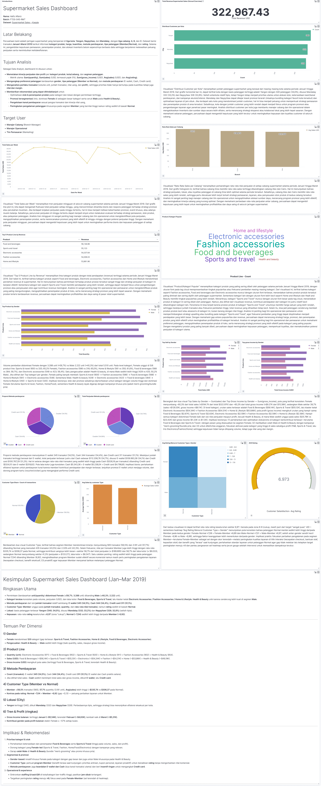

# Judul Project
Supermarket Sales Analysis & ETL Automation

## Repository Outline
1. /gx_context - output dari hasil validasi data dengan great expetations
2. /images - hasil screenshot Dashboard yang kita buat dengan elasticsearch dan kibana
3. P2M3_hafiz_alfariz_conceptual.txt - Jawaban pertanyaan dari Conceptual problem
4. P2M3_hafiz_alfariz_DAG.py - Script Airflow DAG untuk pipeline ETL otomatis
5. P2M3_hafiz_alfariz_data_clean_csv - hasil data clean yang diolah oleh airflow  yang kita ambil dari folder /dags pada repository project_m3
6. P2M3_hafiz_alfariz_data_raw.csv - Data raw yang diambil pada https://www.kaggle.com/datasets/faresashraf1001/supermarket-sales/data
7. P2M3_hafiz_alfariz_ddl.txt - adalah file untuk menunjukan URL dataset yang dijadikan acuan, Syntax DDL untuk pembuatan table dan Syntax DML untuk melakukan insert data ke database.
8. P2M3_hafiz_alfariz_GX.ipynb - Notebook validasi data dengan Great Expectations.
9. P2M3_hafiz_alfariz_import_csv_to_postgres.ipynb - untuk mengkoneksikan dan memasukan data ke database postgres yang sudah kita buat.
10. description.md - Penjelasan detail project dan dokumentasi
11. README.md - Penjelasan gambaran umum project dan instruksi penggunaan

## Problem Background
Project ini bertujuan untuk mengotomasi proses ETL (Extract, Transform, Load) pada data penjualan supermarket. Permasalahan utama adalah bagaimana membersihkan, memvalidasi, dan memvisualisasikan data penjualan secara efisien agar dapat digunakan untuk analisis bisnis dan pengambilan keputusan.

## Project Output
Output project berupa pipeline ETL otomatis menggunakan Airflow, data penjualan yang sudah bersih dan tervalidasi, serta dashboard interaktif di Kibana untuk analisis penjualan dan insight bisnis.

## Data
Data yang digunakan adalah dataset penjualan supermarket (`super_market_analysis.csv`) yang sudah diubah menjadi (`P2M3_hafiz_alfariz_data_raw.csv`) berisi transaksi penjualan, produk, cabang, tanggal, dan customer. Jumlah baris sekitar 1000, kolom meliputi invoice, product line, branch, city, date, customer type, dsb. Data telah dicek untuk missing values dan duplikasi sebelum dianalisis.

## Method
Metode yang digunakan meliputi:
- ETL pipeline dengan Apache Airflow
- Data cleaning dan transformasi menggunakan pandas
- Validasi data dengan Great Expectations
- Penyimpanan hasil ke PostgreSQL dan Elasticsearch
- Visualisasi dashboard dengan Kibana

## Stacks
- Bahasa pemrograman: Python
- Tools: Docker Compose, Apache Airflow, PostgreSQL, Elasticsearch, Kibana
- Library: pandas, psycopg2, Great Expectations

## Reference
- [Basic Writing and Syntax on Markdown](https://docs.github.com/en/get-started/writing-on-github/getting-started-with-writing-and-formatting-on-github/basic-writing-and-formatting-syntax)
- [Contoh readme](https://github.com/fahmimnalfrzki/Swift-XRT-Automation)
- [Another example](https://github.com/sanggusti/final_bangkit)
- [Additional reference](https://www.freecodecamp.org/news/how-to-write-a-good-readme-file/)

---